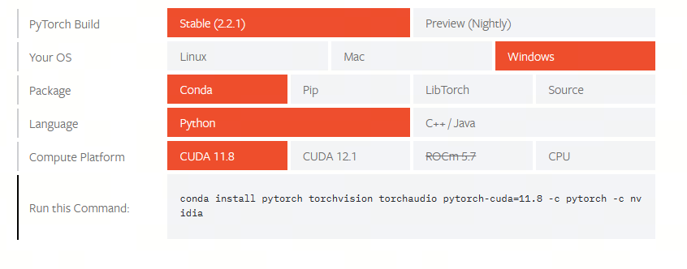
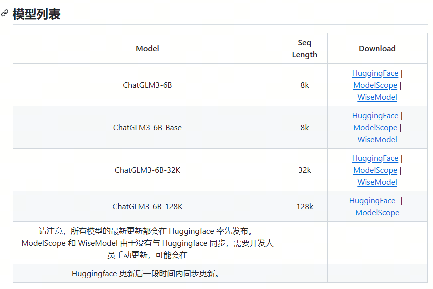
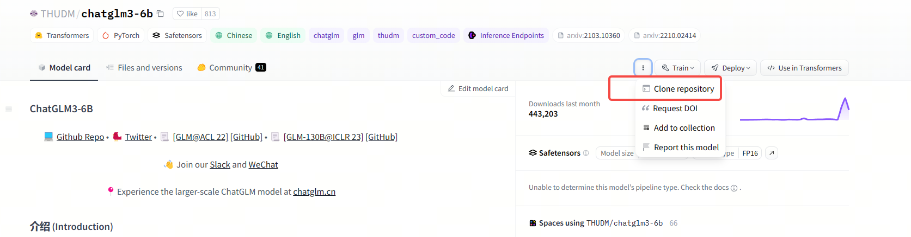
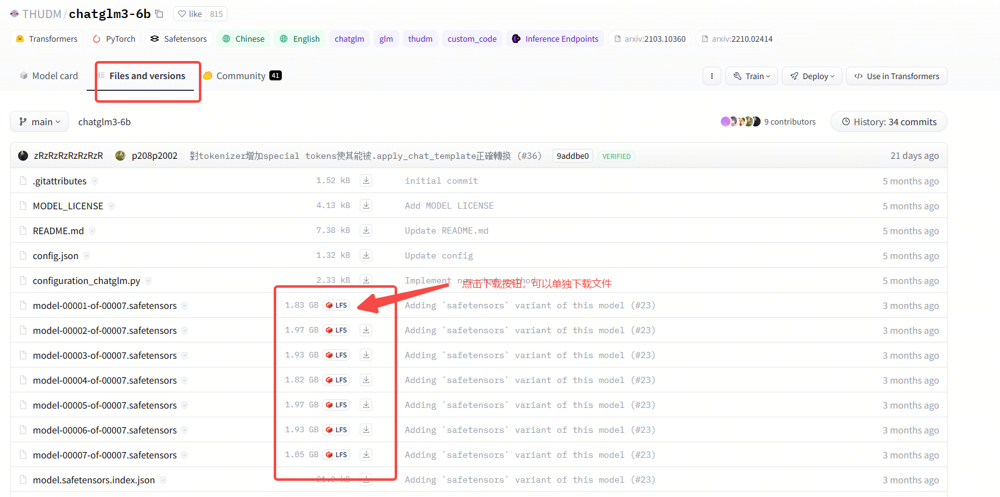
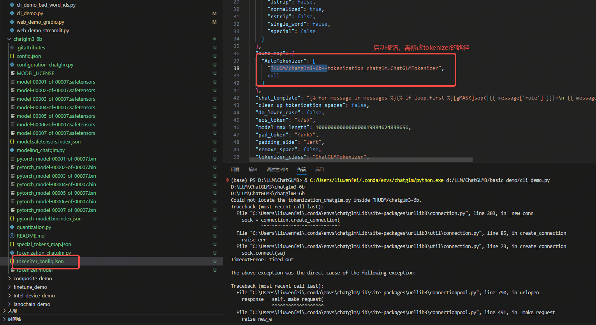

# PicGo+GitHub、gitee入门

## 参考文档

[ChatGLM的GitHub地址](https://github.com/THUDM/ChatGLM-6B)


## 环境

1. 使用conda进行环境配置

```shell
#检查环境
PS C:\Users\liuwenfei> conda env list
# conda environments:
#
base                     C:\ProgramData\anaconda3
bert                     C:\ProgramData\anaconda3\envs\bert
lgbm                     C:\ProgramData\anaconda3\envs\lgbm
py38                     C:\ProgramData\anaconda3\envs\py38

#创建一个环境
PS C:\Users\liuwenfei> conda create -n chatglm python=3.10
Retrieving notices: ...working... done
Collecting package metadata (current_repodata.json): done
Solving environment: done

#激活环境
PS C:\Users\liuwenfei> conda activate chatglm
```

2. 安装cuda
[cuda安装](https://blog.csdn.net/chen565884393/article/details/127905428)

显卡支持查询
```
(chatglm) C:\Users\liuwenfei>nvidia-smi.exe
Mon Jan 29 09:24:00 2024
+---------------------------------------------------------------------------------------+
| NVIDIA-SMI 536.67                 Driver Version: 536.67       CUDA Version: 12.2     |
|-----------------------------------------+----------------------+----------------------+
| GPU  Name                     TCC/WDDM  | Bus-Id        Disp.A | Volatile Uncorr. ECC |
| Fan  Temp   Perf          Pwr:Usage/Cap |         Memory-Usage | GPU-Util  Compute M. |
|                                         |                      |               MIG M. |
|=========================================+======================+======================|
|   0  NVIDIA RTX A4000             WDDM  | 00000000:21:00.0  On |                  Off |
| 41%   34C    P8              17W / 140W |   2470MiB / 16376MiB |     10%      Default |
|                                         |                      |                  N/A |
+-----------------------------------------+----------------------+----------------------+

+---------------------------------------------------------------------------------------+
| Processes:                                                                            |
|  GPU   GI   CI        PID   Type   Process name                            GPU Memory |
|        ID   ID                                                             Usage      |
|=======================================================================================|
|    0   N/A  N/A      2144    C+G   ...siveControlPanel\SystemSettings.exe    N/A      |
|    0   N/A  N/A      3148    C+G   ...crosoft\Edge\Application\msedge.exe    N/A      |
|    0   N/A  N/A      6196    C+G   ...ram Files (x86)\PDManer\PDManer.exe    N/A      |
|    0   N/A  N/A      8152    C+G   ...CBS_cw5n1h2txyewy\TextInputHost.exe    N/A      |
|    0   N/A  N/A      9336    C+G   ...n\120.0.2210.144\msedgewebview2.exe    N/A      |
|    0   N/A  N/A     10000    C+G   C:\Windows\explorer.exe                   N/A      |
|    0   N/A  N/A     11388    C+G   C:\Windows\explorer.exe                   N/A      |
|    0   N/A  N/A     11588    C+G   ...wekyb3d8bbwe\XboxGameBarWidgets.exe    N/A      |
|    0   N/A  N/A     11940    C+G   ...nt.CBS_cw5n1h2txyewy\SearchHost.exe    N/A      |
|    0   N/A  N/A     11964    C+G   ...2txyewy\StartMenuExperienceHost.exe    N/A      |
|    0   N/A  N/A     12056    C+G   ... Files\CorpLink\Client\CorpLink.exe    N/A      |
|    0   N/A  N/A     12272    C+G   ...ekyb3d8bbwe\PhoneExperienceHost.exe    N/A      |
|    0   N/A  N/A     14260    C+G   ...t.LockApp_cw5n1h2txyewy\LockApp.exe    N/A      |
|    0   N/A  N/A     19620    C+G   C:\Miwork\app\Miwork.exe                  N/A      |
|    0   N/A  N/A     19792    C+G   ...5n1h2txyewy\ShellExperienceHost.exe    N/A      |
|    0   N/A  N/A     22932    C+G   ...__8wekyb3d8bbwe\WindowsTerminal.exe    N/A      |
|    0   N/A  N/A     26744    C+G   ...EA 2021.2.2\jbr\bin\jcef_helper.exe    N/A      |
|    0   N/A  N/A     27180    C+G   ...\Docker\frontend\Docker Desktop.exe    N/A      |
|    0   N/A  N/A     33472    C+G   C:\Microsoft VS Code\Code.exe             N/A      |
|    0   N/A  N/A     35064    C+G   ...ocal\Postman\app-9.22.2\Postman.exe    N/A      |
+---------------------------------------------------------------------------------------+
```

安装cuda后查看是否安装成功

使用命令：
```
(chatglm) C:\Users\liuwenfei>nvcc -V
nvcc: NVIDIA (R) Cuda compiler driver
Copyright (c) 2005-2023 NVIDIA Corporation
Built on Tue_Jun_13_19:42:34_Pacific_Daylight_Time_2023
Cuda compilation tools, release 12.2, V12.2.91
Build cuda_12.2.r12.2/compiler.32965470_0

```

3. 安装pytorch
[pytorch官网](https://pytorch.org/get-started/locally/)
进入pytorch官网的安装引导页面，按照电脑的配置进行选择，需要注意的是，这里的compute Platform指的是要运行pytorch的平台，
如果没有GPU，想用CPU运行，则选择CPU，如果电脑有GPU显卡，可以选择CUDA11.8,CUDA12.1两个选项，分别对应的是CUDA的最高支持版本。
安装pytorch时，会一并下载安装对应的CUDA。


```shell
conda install pytorch torchvision torchaudio pytorch-cuda=11.8 -c pytorch -c nvidia
```

安装后验证：
进入命令行，输入python，进入python命令行模式，然后使用如下命令，
```python
import torch
x = torch.rand(5, 3)
print(x)
```
如果正常输出，则表示安装成功

验证是否cuda版本命令如下：
```python
import torch
torch.cuda.is_available()
```

## 安装chatglm
首先我们需要从github上下载chatGLM的项目文件。
GitHub仓库地址：

在github上已经有非常详细的模型介绍，包括非常多的开源扩展项目。也可以按照需要从不同的开源仓库下载并安装对应的模型和项目

1. 使用git下载仓库代码
```
git clone https://github.com/THUDM/ChatGLM3
```
2. 下载后，进入代码目录，并执行python依赖包的安装
这里需要注意，我们需要在创建的conda对应的环境下安装，否则安装到其他环境中，启动模型项目会找不到包
```
cd ChatGLM3
pip install -r requirements.txt
```

3. 到这里，我们的环境和项目代码都已经安装完成，我们需要下载模型权重文件



使用huggingface国内镜像站进行下载
[hf-mirror](https://hf-mirror.com/)
直接在首页进行模型搜索，页面和huggingface一样。
进入后找到下载的命令，根据说明引导进行下载


使用国内的魔搭社区来下载模型文件
[魔搭社区](https://modelscope.cn/models/ZhipuAI/chatglm3-6b/summary)

```shell
#安装依赖
pip install protobuf 'transformers>=4.30.2' cpm_kernels 'torch>=2.0' gradio mdtex2html sentencepiece accelerate

#下载模型文件
#1 魔搭社区工具下载
pip install modelscope
from modelscope import snapshot_download
model_dir = snapshot_download("ZhipuAI/chatglm3-6b", revision = "v1.0.0")
#2 使用git lfs 下载
git lfs install
git clone https://www.modelscope.cn/ZhipuAI/chatglm3-6b.git


```
4. git拉取大文件，很有可能会失败
```shell
(chatglm) PS D:\llm\ChatGLM3> git clone https://hf-mirror.com/THUDM/chatglm3-6b
Cloning into 'chatglm3-6b'...
remote: Enumerating objects: 119, done.
remote: Counting objects: 100% (116/116), done.
remote: Compressing objects: 100% (115/115), done.
remote: Total 119 (delta 55), reused 0 (delta 0), pack-reused 3
Receiving objects: 100% (119/119), 48.01 KiB | 2.09 MiB/s, done.
Resolving deltas: 100% (55/55), done.
Updating files: 100% (27/27), done.
Downloading model-00001-of-00007.safetensors (1.8 GB)
Error downloading object: model-00001-of-00007.safetensors (b105238): Smudge error: Error downloading model-00001-of-00007.safetensors (b1052386eac358a18add3d0f92521c85ab338979da8eeb08a6499555b857f80d): LFS: Get "https://cdn-lfs-us-1.huggingface.co/repos/01/5a/015a4eda6314fbcdb0aecc00e73f604e0f398b10ef843cf3e7bfcf8d0b9c1d7d/b1052386eac358a18add3d0f92521c85ab338979da8eeb08a6499555b857f80d?Expires=1710639998&Policy=eyJTdGF0ZW1lbnQiOlt7IkNvbmRpdGlvbiI6eyJEYXRlTGVzc1RoYW4iOnsiQVdTOkVwb2NoVGltZSI6MTcxMDYzOTk5OH19LCJSZXNvdXJjZSI6Imh0dHBzOi8vY2RuLWxmcy11cy0xLmh1Z2dpbmdmYWNlLmNvL3JlcG9zLzAxLzVhLzAxNWE0ZWRhNjMxNGZiY2RiMGFlY2MwMGU3M2Y2MDRlMGYzOThiMTBlZjg0M2NmM2U3YmZjZjhkMGI5YzFkN2QvYjEwNTIzODZlYWMzNThhMThhZGQzZDBmOTI1MjFjODVhYjMzODk3OWRhOGVlYjA4YTY0OTk1NTViODU3ZjgwZCJ9XX0_&Signature=Eiy4nstA9wfHC0xnQo1LsGR%7EPWaRP0K8ucDHXojEvSxlH5KZKqnKYQVxjeqKPU6BUj%7ELEB6E1QJDCmBJReZ1lRgl2h-MTib3IxwqNoS8G-lhrlQgr7lysr6ygGrVVFIPHpwZLZdMDamUKE8b4VRl7E5bsarYIQ3F4eedTLSIcTG8ytt0drJZFrE1MzOxTgMdHqAVFtcE8DsVEHMGGQ5uqGrnwTmKUxHaVpF6JY2GG9Ttv6s08YeI21C8m8499eOOJ08HIpiDj2mYLiJlUtEsa-q5HTRg7Sc8S1fIYZvHw5ztnUblz2wqGVx5FfK7gLy86nbfHEJSYiPwQ9d9jFOLFw__&Key-Pair-Id=KCD77M1F0VK2B": x509: certificate is valid for *.facebook.com, *.facebook.net, *.fbcdn.net, *.fbsbx.com, *.m.facebook.com, *.messenger.com, *.xx.fbcdn.net, *.xy.fbcdn.net, *.xz.fbcdn.net, facebook.com, messenger.com, not cdn-lfs-us-1.huggingface.co

Errors logged to 'D:\LLM\ChatGLM3\chatglm3-6b\.git\lfs\logs\20240314T094637.885519.log'.
Use `git lfs logs last` to view the log.
error: external filter 'git-lfs filter-process' failed
fatal: model-00001-of-00007.safetensors: smudge filter lfs failed
warning: Clone succeeded, but checkout failed.
You can inspect what was checked out with 'git status'
and retry with 'git restore --source=HEAD :/'
```
这种情况，我们可以进入huggingface 或者hf-mirror的页面中的文件列表，手动下载

通过这种方式，我们可以把模型权重文件一个个的下载。放入到对应的路径即可

5. 本地模型权重文件放置路径：
权重文件要放对位置，huggingface transformers默认缓存的位置在这个路径下：C:\Users\用户名字\.cache\，
因此我们也需要把文件方到对应的路径下才行，
huggingface\hub\models--THUDM--chatglm-6b\snapshots\220f772e9a2d7a55701d9b49bf2efc618acc3b56
把文件放过去以后，运行就不会去下载上面几个大文件了，就能跑起来
python web_demo.py

6. 启动报错
使用本地加载权重模型时，新版本的模型，会报错：Could not locate the tokenization_chatglm.py inside THUDM/chatglm3-6b.
这里需要修改配置文件中的指向：
