# 抓包工具Fiddler
> [fiddler官网](https://www.telerik.com)

## 一、下载安装
安装包下载链接：[fiddler classic](https://www.telerik.com/fiddler/fiddler-classic)

进入网页之后，需要填写一下用途等信息，可以随意填写，之后下载后安装即可免费使用
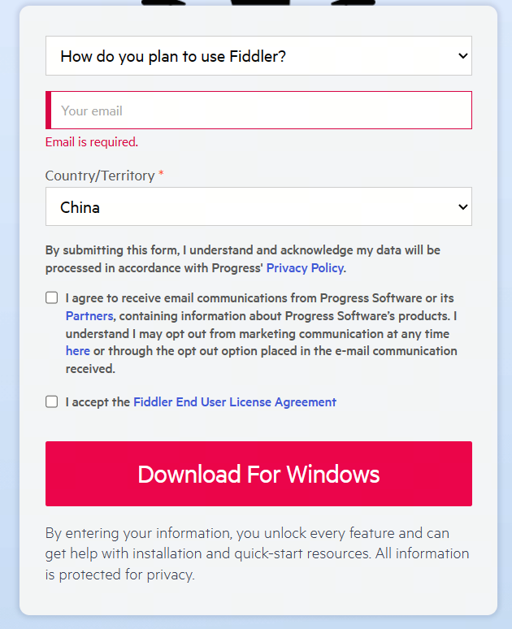

## 二、常用配置
### 1.HTTPS配置
进入 Rules-Options：
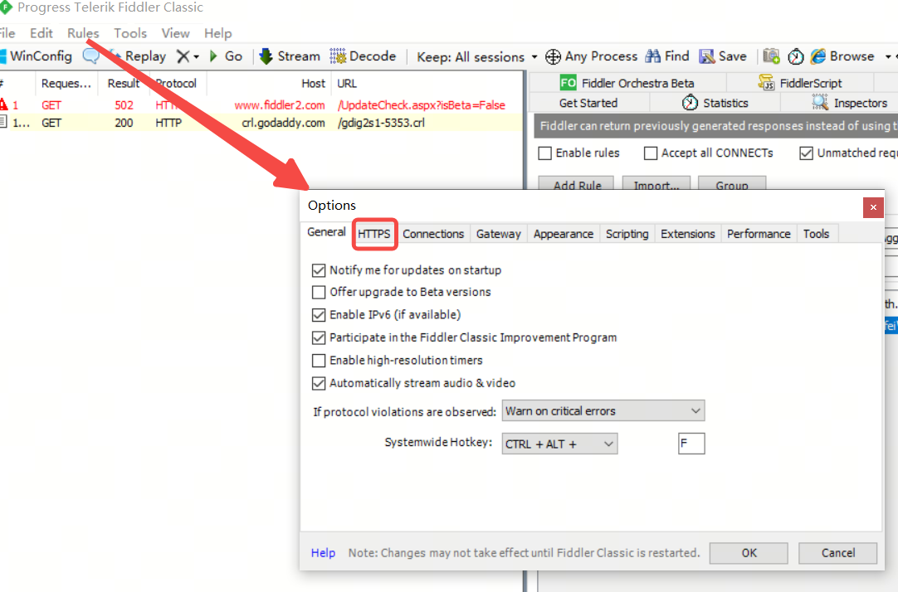
在options的HTTPS的tab界面中，勾选上以下选项
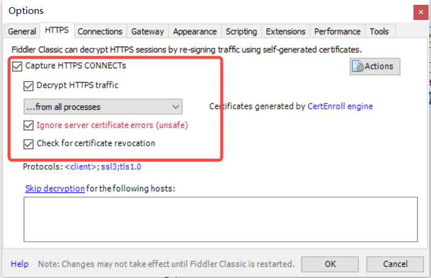

勾选完成后，点击OK保存，在弹出的对话框中，会有询问是否要安装认证证书到机器（Add certificate to the Machine Root List？）的选项，注意选择YES进行安装，这样就可以对HTTPS的网络请求进行抓包拦截啦。

TIPS：如果没有安装证书，可以再次进行配置安装，或者手动导出证书，在浏览器中进行手动配置：

1. 在Actions下拉选项中，选择：Trust Root Certificate ，信任证书；然后选择：Export Root Certificate to Desktop ，这个选项将会导出证书到本地。

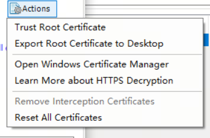

2. 可以双击安装证书，然后下一步、下一步，最后点击完成即可
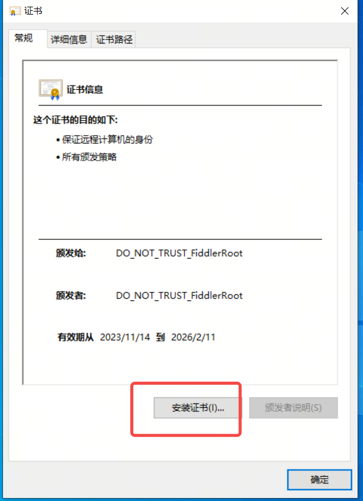

3. 或者可以在浏览器中进行证书配置：打开浏览器的设置，找到 隐私、搜索和服务中的安全性-》管理证书
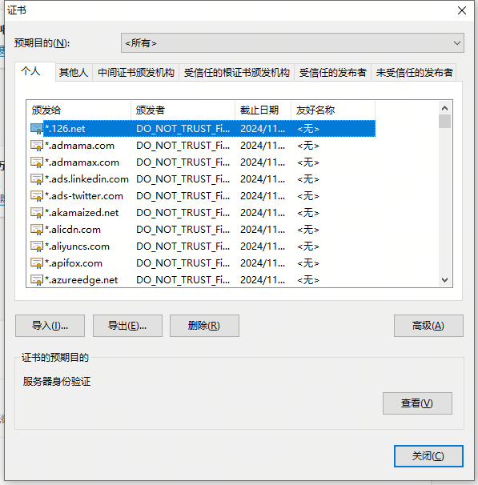
选择受信任的根证书颁发机构，然后导入即可。

### 2.过滤配置
在Rules选项中可以配置过滤规则：
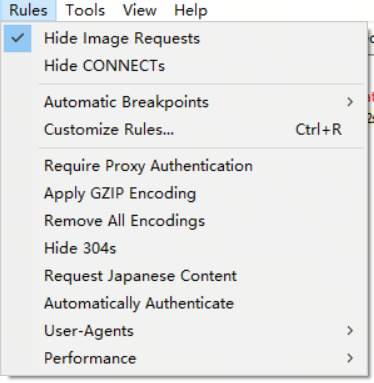
1. 过滤图片
Hide Image Requests
2. 过滤连接请求
Hide CONNECTs
3. 配置断点
Automatic Breakpoints
4. 自定义脚本
Customize Rules

### 3.配置拦截规则
通过打开和关闭Filters，可以进行拦截的启用和关闭，在Filters选项卡中可以配置拦截规则的定义
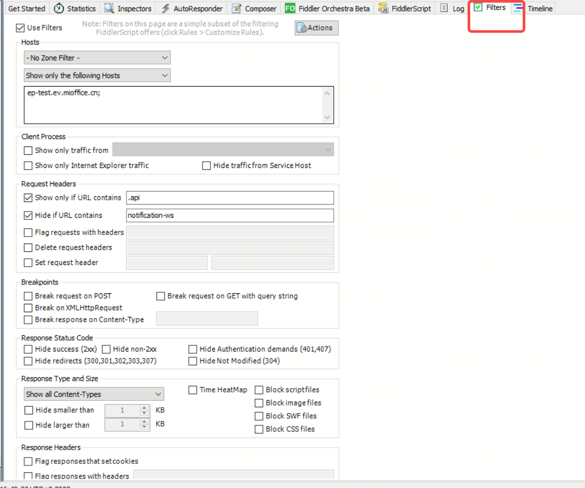
1. 勾选Use Filters 控制打开和关闭过滤
第一个是根据Hosts 进行过滤，第一个选项保持默认；第二个选项分别为：不过滤、隐藏配置的host、仅显示配置的host、标记配置的host，输入框则是如数域名，多个使用冒号分隔
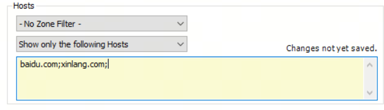
2. Client Process 
配置客户端来源

3. Request Headers 
根据请求 Headers进行过滤

4. Breakpoints
配置断点功能

5. Response Status Code
根据响应状态进行过滤的规则

6. Response Type and Size 
配置根据响应类型和大小进行过滤的规则

7. Response Headers
根据响应头进行过滤和设置的规则。

### 4.拦截并修改响应结果

1. 使用Automatic Breakpoints 功能
    1. 拦截请求
    2. 拦截响应
    3. 关闭
    4. 忽略图片
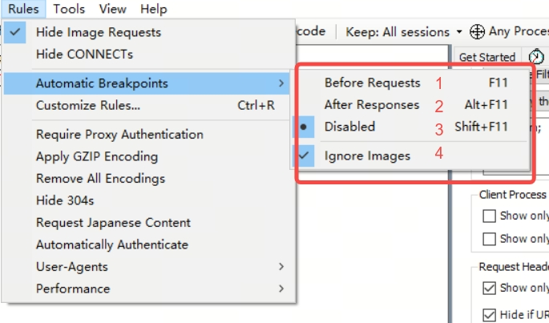
该功能可以对所有的请求和响应进行拦截，相当于进行断点调试，适用于DEBUG使用。

2. 使用AutoResponder
先看截图：
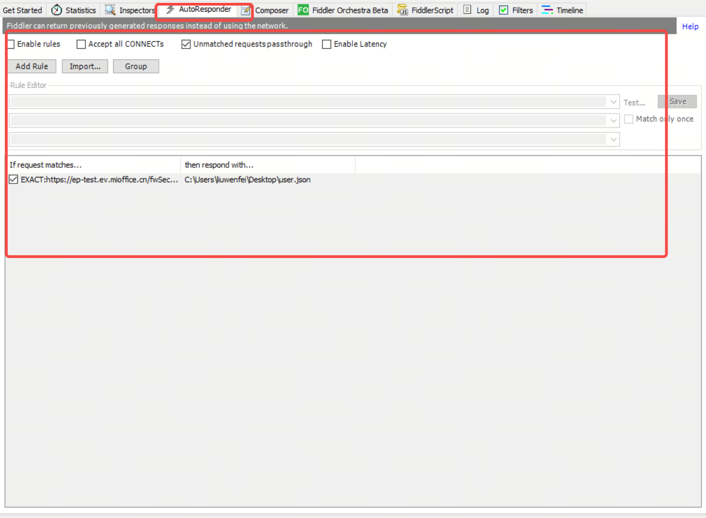

在右侧的tab中点击AutoResponder 进入的，是进行方法级别拦截并进行响应mock的功能。
使用方法：
1. 选择某个方法
2. 点击Add Rule
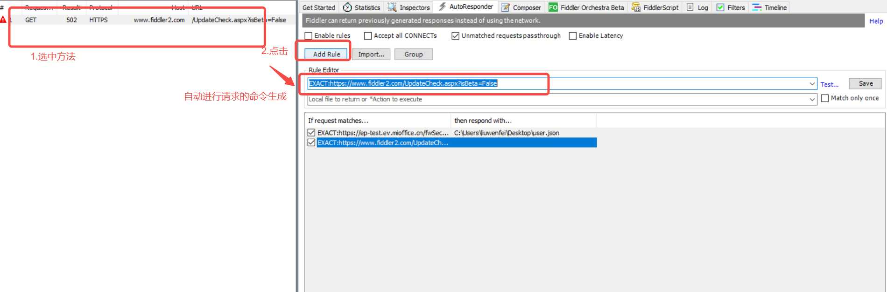
3. 进行Response的控制，这里我使用的是本地json文件进行响应的mock

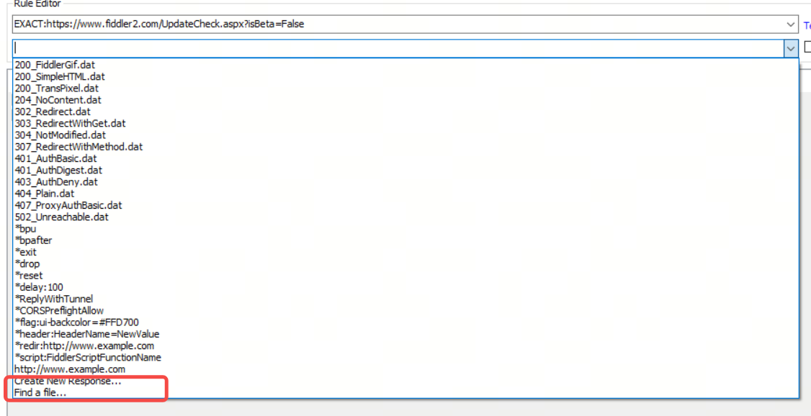

这里可以配置多个Rules，可以根据需要进行勾选生效。如果要关闭所有，则关闭左上角的Enable rules即可。