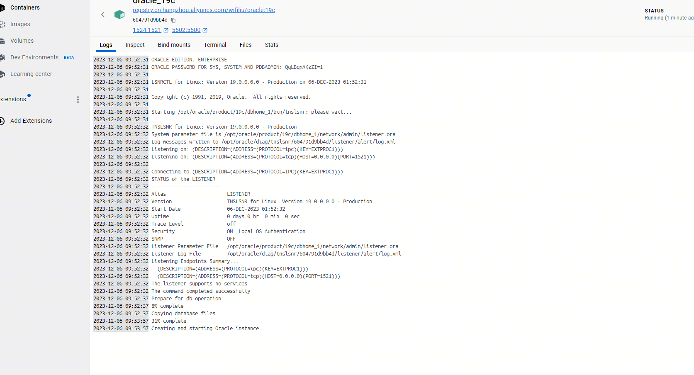
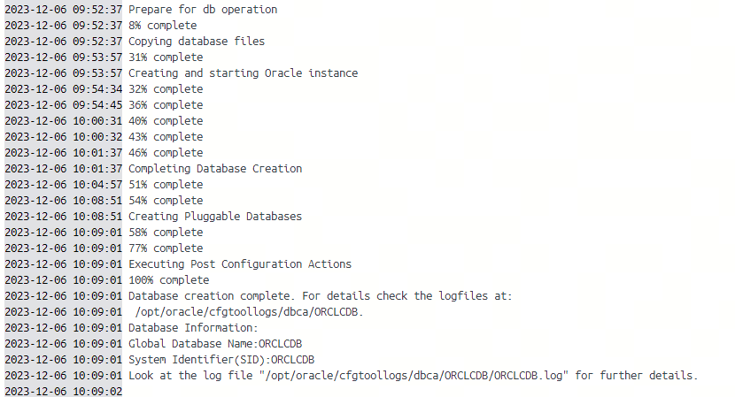
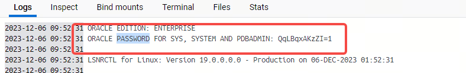
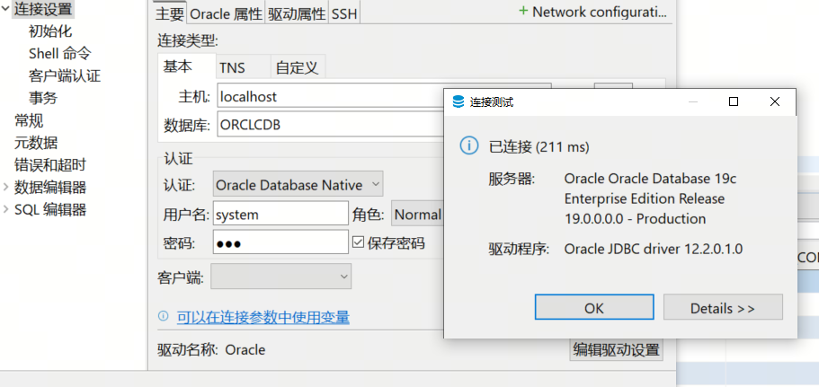
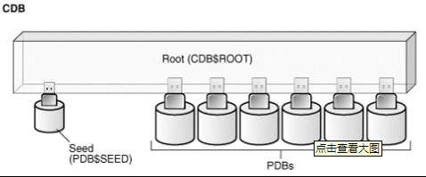
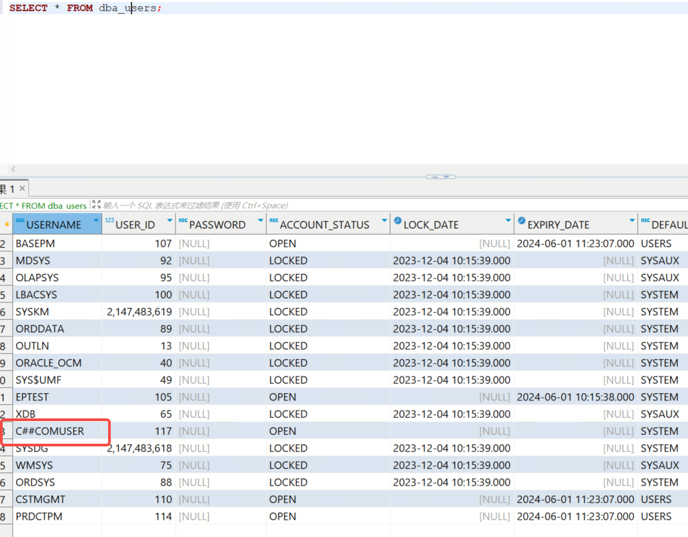

# Docker安装oracle并配置

本文档记录了使用docker安装oracle 19c，并进行数据库基础配置、使用dmp进行数据库克隆配置的流程。

# Docker安装oracle
## 一、获取镜像
使用docker搜索oracle对应版本镜像拉取，网上很多的oracle镜像没有文档说明，因此这里做了安装和配置的步骤和说明~

- oracle-11g
```shell
docker pull registry.cn-hangzhou.aliyuncs.com/wifiliu/oracle:11g
```
- oracle-19c
```shell
docker pull registry.cn-hangzhou.aliyuncs.com/wifiliu/oracle:19c
```

## 二、启动镜像
启动命令：
```shell
#11g
docker run -d -p 1521:1521 --name oracle  registry.aliyuncs.com/wifiliu/oracle:11g

#19c详细启动命令：
docker run --name oracle_19c -p 1524:1521 -p 5502:5500  -d registry.cn-hangzhou.aliyuncs.com/wifiliu/oracle:19c
```
使用docker命令查看是否启动成功：
```shell
PS C:\Users\liuwenfei> docker run --name oracle_19c -p 1524:1521 -p 5502:5500  -d registry.cn-hangzhou.aliyuncs.com/wifiliu/oracle:19c
604791d9bb4d53650e45d7340d750db177236e72bd686a718fa5854acdbea592
PS C:\Users\liuwenfei> docker ps
CONTAINER ID   IMAGE                                                  COMMAND                   CREATED         STATUS                            PORTS                                            NAMES
604791d9bb4d   registry.cn-hangzhou.aliyuncs.com/wifiliu/oracle:19c   "/bin/sh -c 'exec $O…"   6 seconds ago   Up 5 seconds (health: starting)   0.0.0.0:1524->1521/tcp, 0.0.0.0:5502->5500/tcp   oracle_19c
PS C:\Users\liuwenfei>

```
使用docker 客户端可以在containers中直接点击查看镜像实例的运行情况和详细信息~


第一次创建容器实例时，oracle数据库需要进行初始化，在logs中会有日志显示，等待初始化完成之后才可以进行使用。


## 三、配置ORACLE_SID
使用sqlplus的nolog方式登录服务器遇到ORA-12162报错，一般是因为没有配置ORACLE_SID这个环境变量导致。

启动oracle后，我们使用sqlplus登录服务器，
```sql
sh-4.2$ sqlplus /nolog

SQL*Plus: Release 19.0.0.0.0 - Production on Wed Dec 6 01:55:45 2023
Version 19.3.0.0.0

Copyright (c) 1982, 2019, Oracle.  All rights reserved.

SQL> conn /as sysdba
ERROR:
ORA-12162: TNS:net service name is incorrectly specified

SQL>
```
### 三、配置环境变量
一般情况下docker容器都是使用非root账号运行，我们想要修改环境变量配置文件，需要使用root用户登录
```shell
#使用root登录
PS C:\Users\liuwenfei> docker exec -it --user=root oracle_19c /bin/bash
#修改配置文档 在文档最后append export ORACLE_SID=ORCLCDB
bash-4.2# vim /etc/profile
# 刷新配置
bash-4.2# source /etc/profile
bash-4.2# echo $ORACLE_SID
ORCLCDB
bash-4.2#
```
配置ORACLE_SID变量之后，重新登录sqlplus,连接数据库成功
```sql
sh-4.2$ sqlplus /nolog

SQL*Plus: Release 19.0.0.0.0 - Production on Wed Dec 6 03:33:12 2023
Version 19.3.0.0.0

Copyright (c) 1982, 2019, Oracle.  All rights reserved.

SQL> conn /as sysdba
Connected.
SQL> show pdbs;

    CON_ID CON_NAME                       OPEN MODE  RESTRICTED
---------- ------------------------------ ---------- ----------
         2 PDB$SEED                       READ ONLY  NO
         3 ORCLPDB1                       READ WRITE NO
SQL>
```

### 四、修改账号密码、配置文件
默认启动的docker容器的管理员密码在第一次启动时的log日志中显示，一般会创建为随机密码，

我们可以通过服务端sqlplus进行修改：
```sql
SQL> alter user sys identified by 123;

User altered.

SQL> alter user system identified by 123;

User altered.
```
修改后，我们可以使用客户端进行连接测试：


# oracle 12的数据库架构
在创建数据库前，我们需要先要了解一下oracle 12版本的数据库、用户、CDB与PDB之间的关系。

## 概念：

1. Multitenant Environment：多租户环境

2. CDB（Container Database）：数据库容器

3. PDB（Pluggable Database）：可插拔数据库

4. PDB$SEED：PDB数据库模板，只读用来创建PDB使用

5. COMMON USERS(普通用户)：建立在CDB层，用户名以C##或c##开头；

6. LOCAL USERS(本地用户)：仅建立在PDB层，建立的时候得指定CONTAINER。



在oracle 12中，引入了container，使用CDB层作为数据库抽象层，在这一层中，实际上是不能真正的存储数据的，数据存储在PDB（插拔数据库）中，oracle通过这样的设计把整个数据库服务端设计成了多租户形式，在每个机器上都可以实现多租户的数据库设计。

相应的，在CDB层上的用户是公有用户，也就是在CDB上创建的用户是可以操作所有的PDB（所有PDB的公有用户），为了区分这样的用户，oracle 12中创建此类用户需要在名称前添加`C##`这个特殊前缀。因此，在CDB下创建用户必须添加`C##`，在PDB下可以创建普通用户。

SQL示例:
```SQL
---不登陆方式打开sqlplus
sqlplus /nolog

---以syadba账号链接
conn /as sysdba

---查询当前用户
show user;
---线上当前容器
show con_name;

---显示当前的pdb
show pdbs;

---查询当前数据库信息
SELECT *  FROM "V$DATABASE" ;

-- 切回到CDB 容器数据库
alter session set container=CDB$ROOT; 
```


# 创建PDB
PDB(pluggable database)是可插拔数据库，也就是我们使用的实例，下面我们创建PDB。
## 从seed库克隆创建
oracle数据库安装后一般情况下会带有一个PDB#SEED的数据库，这个数据库的状态是READ ONLY的，我们创建PDB时，一般使用seed来进行pdb的创建
```sql
SQL> show pdbs;

    CON_ID CON_NAME                       OPEN MODE  RESTRICTED
---------- ------------------------------ ---------- ----------
         2 PDB$SEED                       READ ONLY  NO
         3 ORCLPDB1                       READ WRITE NO
      
SQL>
```
- SQL语法：
create pluggable database [databaseName] admin user [userName] identified by [password] 
file_name_convert=('pdbseed','[pathName]');
这里的file_name_convert函数接收两个参数，第一个参数是我们要copy的seed数据库的文件夹路径，第二个是我们的表空间文件夹路径，这里可以使用全路径或简写两种方式。
```sql
SQL> create pluggable database EPTEST admin user test1 identified by test1 file_name_convert=('pdbseed','EPTEST')
  2  ;

Pluggable database created.

SQL> show pdbs

    CON_ID CON_NAME                       OPEN MODE  RESTRICTED
---------- ------------------------------ ---------- ----------
         2 PDB$SEED                       READ ONLY  NO
         3 ORCLPDB1                       READ WRITE NO
         4 EPTEST                         MOUNTED

SQL>
```
> 这样创建的PDB默认只创建了SYSTEM,SYSAUX,TEMP,UNDO表空间(19c环境)

也可以指定默认用户表空间来进行创建：
create pluggable database [databaseName] admin user [userName] identified by [password] 
file_name_convert=('pdbseed','[pathName]')
default tablespace users
datafile '/u01/app/oracle/oradata/ORA19C/testpdb3/user01.dbf' size 10m autoextend on;

创建完PDB数据库之后，默认情况下的数据库处于mount状态：
```sql
SQL> show pdbs

    CON_ID CON_NAME                       OPEN MODE  RESTRICTED
---------- ------------------------------ ---------- ----------
         2 PDB$SEED                       READ ONLY  NO
         3 ORCLPDB1                       READ WRITE NO
         4 EPTEST                         MOUNTED

SQL>
``` 
需要我们执行open操作，打开database，同时保存PDB数据库的默认状态：
```sql
--开启pdb数据库
SQL> alter pluggable database EPTEST open;

Pluggable database altered.
--保存pdb数据库状态在数据库启动时自动开启
SQL> alter pluggable database EPTEST save state;

Pluggable database altered.
--切换当前sqlplus的会话到指定的pdb
SQL> alter session set container=EPTEST;

Session altered.
--查看当前数据库
SQL> show con_name;

CON_NAME
------------------------------
EPTEST
```

## 从非SEED库克隆创建
我们也可以从已经存在的非seed库进行克隆:

```sql
CREATE PLUGGABLE DATABASE [databaseName] FROM [oldDatabaseName];
alter pluggable database [databaseName] open;
```
```sql
SQL> create pluggable database [databaseName] from  [oldDatabaseName]
file_name_convert=('[oldName]','[newName]');
```
克隆之后的操作与seed克隆一样

数据库信息查询语句
```sql

--查看数据库信息
select * from v$version

--查看数据库基础配置
select * from nls_database_parameters

```

## 修改配置文件
创建好pdb数据库后，还需要修改对应的配置文件`tnsnames.ora`,该文件一般在$ORACLE_HOME/network/admin/ 文件夹下，直接在文件后面添加如下配置即可
如果不进行配置文件修改，在使用账号密码登录PDB数据库时会遇到ORA-12154的报错：
`ORA-12154: TNS:could not resolve the connect identifier specified`
```shell
PS C:\Users\liuwenfei> docker exec -it oracle_19c /bin/bash
[oracle@604791d9bb4d ~]$ cd $ORACLE_HOME/network/admin
[oracle@604791d9bb4d admin]$ ls
listener.ora  samples  shrept.lst  sqlnet.ora  tnsnames.ora
[oracle@604791d9bb4d admin]$
#默认是ORCL
ORCL =
  (DESCRIPTION =
    (ADDRESS = (PROTOCOL = TCP)(HOST = localhost)(PORT = 1521))
    (CONNECT_DATA =
      (SERVER = DEDICATED)
      (SERVICE_NAME = orcl)
    )
  )
#新建的PDB
PDB_NAME =
  (DESCRIPTION =
    (ADDRESS = (PROTOCOL = TCP)(HOST = localhost)(PORT = 1521))
    (CONNECT_DATA =
      (SERVER = DEDICATED)
      (SERVICE_NAME = PDB_NAME)
    )
  )
```

## 拔出和插入PDB
### 拔出PDB

```sql
--1.关闭PDB数据库
SQL> alter pluggable database [databaseName] close immediate;
 
Pluggable database altered.
---2.拔出pdb
SQL> alter pluggable database [databaseName] unplug into '/home/oracle/pdb.xml';
  
```
注意：
1. 被拔出的PDB只能被删除,不能做其它操作,例如mount,打开等,删除之后我们仍然可以再插入.    

2. 拔出PDB的时候需要指定xml位置,xml中记录了PDB的信息,例如数据文件目录,DBID,PDB参数等等

 


### 插入PDB

插入PDB使用create pluggable database指定xml位置操作：

一、拔出的PDB再进行插入：
```sql
SQL> create pluggable database [databaseName] using '/home/oracle/testpdb4.xml' nocopy;   
 
Pluggable database created.

```
此时我们就可以把删除的PDB重新插入到CDB中，相当于又加回来了。
二、拔出PDB在不同的数据库上插入：
有时候我们拔出的PDB会在其他数据库上进行插入，这时候我们需要对文件路径和数据库名称等进行配置
```sql
SQL> create pluggable database [databaseName] using '/tmp/pdb.xml' 
SOURCE_FILE_NAME_CONVERT=('[xml_file_path]','[current_file_path]')
MOVE FILE_NAME_CONVERT=('[current_file_path]','[PDB_file_path]')
PATH_PREFIX='[PDB_file_path]' ;

```
当xml中的文件路径和我们放置的文件路径不一样时，
1. 我们需要进行source路径配置 SOURCE_FILE_NAME_CONVERT
2. 我们需要配置文件copy路径：FILE_NAME_CONVERT
3. 配置路径前缀PATH_PREFIX='[PDB_file_path]'
也就是：xml文件中的路径是xml_file_path，而实际的文件路径是current_file_path，最终我们把文件copy到pdb_file_path下。


三、查看插入PDB是否有报错
```sql
SQL> select name,cause,type,message,status from PDB_PLUG_IN_VIOLATIONs order by name;
```

## 删除PDB
删除PDB之前需要将PDB先关闭,使用drop pluggable database命令:
```sql
SQL> alter pluggable database [databaseName] close;
 
Pluggable database altered.
 
SQL>  drop pluggable database  [databaseName] including datafiles;
 
Pluggable database dropped.
```
- drop命令：
  如果使用了including datafiles则会将数据文件一起删除.
  使用keep datafiles会保留数据文件,默认如果不添加参数即为keep datafiles,但是注意keep datafiles则必须先将PDB拔出,所以一般是用在拔出和插入PDB场景下.

 

# 创建用户

我们使用sqlplus默认登录之后，链接进入的是CDB，在这个session中，我们只能创建common user，直接执行create user命令一般会遇到ORA-65096这个错误：
`ORA-65096: invalid common user or role name`
这是因为在CDB层我们只能创建common user ，要创建实例数据库用户需要在相对应的PDB会话中。

## 创建用户
``` sql
SQL> show con_name;

CON_NAME
------------------------------
CDB$ROOT
SQL> create user c##comuser identified by 123;

User created.

--创建common用户

create user C##用户名称 identified by 密码 default tablespace 表空间;

--授权
grant connect,resource to C##用户名称;
grant dba to C##用户名称;

SQL>

--创建普通用户
--1.切换到pdb会话
alter session set container=pdbname;
--2.创建用户
create user 用户名称 identified by 密码 default tablespace 表空间;

--授权
grant connect,resource to 用户名称;

SQL>

```


## 查询版本和切换pdb
```sql
--查询当前版本
SQL> select * from v$version;

--查询当前容器数据库信息
SQL>select sys_context ('USERENV', 'CON_NAME') from dual; 
--也可以使用下面这个
SQL>SHOW CON_NAME;

--查询pdb列表
SQL>show pdbs;
---或者
SQL>SELECT * FROM V$pdbs;


```


# 创建表空间
oracle中的表空间是数据库级别下的一个空间概念，我们创建的用户和表都需要处在一个表空间中才行，因此一般创建数据库之后，需要给这个数据库创建一个表空间，用来作为我们创建scheme(user)的空间
- 创建表空间的sql语法：
``` sql
--建立临时表空间
CREATE TEMPORARY TABLESPACE temp_name --创建名为temp_name的临时表空间
TEMPFILE 'D:\app\super\oradata\oracle\temp_name.DBF'    -- 临时文件
SIZE 50M    -- 其初始大小为50M
AUTOEXTEND ON    -- 支持自动扩展
NEXT 50M MAXSIZE 20480M    -- 每次增量为50M ,最大2048M
EXTENT MANAGEMENT LOCAL
MAXSIZE 10g; --文件最大多少
;
 
--建立表空间
CREATE TABLESPACE test_name --创建名为"test_name"的表空间
LOGGING
DATAFILE 'D:\app\super\oradata\oracle\test_name.DBF'
SIZE 50M    -- 其初始大小为50M
AUTOEXTEND ON    -- 支持自动扩展
NEXT 50M MAXSIZE 20480M    -- 每次增量为50M ,最大2048M
EXTENT MANAGEMENT LOCAL
MAXSIZE 10g; --文件最大多少
;
```
- sql示例：
```sql
---创建表空间
create tablespace name datafile '/opt/oracle/oradata/rayfoo_pdb.dbf' size 100m autoextend on next 100m maxsize 10g;

create TABLESPACE T1EP logging datafile '/opt/oracle/oradata/ORCLCDB/EPTEST/t1ep.dbf' size 50m autoextend on;
create TABLESPACE users logging datafile '/opt/oracle/oradata/ORCLCDB/EPTEST/t1ep.dbf' size 50m autoextend on;
```
----

- 设置数据库默认表空间
```sql
SQL> alter database default tablespace users;

Database altered.
```

- 表空间相关信息查询：
```sql
--查看用户的表空间
select default_tablespace from dba_users where username='登录用户'

--查询当前数据库所有的表空间
select * from dba_tablespaces;


--修改表空间名称
SQL> alter tablespace lims rename to lims_data;
 
```


# 用户
## 创建普通用户
切换到对应的pdb数据库之后，就可以创建对应的pdb中的普通用户啦
```sql

-- 切换容器 这里需要权限
alter session set container=ORCLPDB1;

--创建用户
create user userName identified by password default tablespace tablespaceName;

```
```sql
--给用户授权
grant connect,resource,dba to user_name;

-- 给用户user_name 授权。

--connect和resource是两个系统内置的角色，和dba是并列的关系。


--DBA：拥有全部特权，是系统最高权限，只有DBA才可以创建数据库结构。
--RESOURCE:拥有Resource权限的用户只可以创建实体，不可以创建数据库结构。
--CONNECT：拥有Connect权限的用户只可以登录Oracle，不可以创建实体，不可以创建数据库结构。

grant 
create any directory,
create session,
create table,
create view,
unlimited tablespace
to userName;
```


# 使用impdp/expdp

impdp/expdp和sqlplus一样，是oracle服务提供的cmd命令，用来进行数据库的导入、导出。

## 文件夹
在导入导出中一般会使用到directory文件夹，这个是在sqlplus进入对应的数据库中，创建指定的文件夹变量;
如果某个数据库中没有对应的directory变量，而在导入导出命令中使用，则会导致执行失败。
```sql
--进入指定的PDB数据库
SQL> alter session set container=EPTEST;

Session altered.
--创建文件夹 
create directory dir as '/home/oracle';

--给文件夹设置权限
grant read,write,execute on directory dir to username;

---查询文件夹
select * from dba_directories;

```

## expdp导出
我们在服务端可以使用expdp导出dmp文件（不需要进入sqlplus，impdp/expdp和sqlplus一样是cmd命令），主要的命令是：
```shell

#按用户/schema导
expdp [username]/[password]@[database] schemas=[schema1,schema2] dumpfile=expdp.dmp DIRECTORY=dpdata logfile=expdlog.log;

#按表名导,表名需要带上scheme
expdp [username]/[password]@[database] tables=[tablename1,tablename2] dumpfile=expdp.dmp DIRECTORY=dpdata logfile=expdlog.log ;

#按查询条件导，主要用来导出表和表中的指定数据
expdp [username]/[password]@[database] tables=tablename1 dumpfile=expdp.dmp DIRECTORY=dpdata logfile=expdlog.log query='where id<1000';

#按表空间导
expdp [username]/[password]@[database] TABLESPACES=[tbspacename1,tbspacename2] dumpfile=expdp.dmp DIRECTORY=dpdata logfile=expdlog.log;

# 整个数据库
expdp [username]/[password]  dumpfile=expdp.dmp DIRECTORY=dpdata logfile=expdlog.log FULL=y;

```

> 命令可以添加parallel=number  来设置并行执行线程数量


## impdp导入
impdp导入命令对应expdp命令，其中的参数基本一致，在使用impdp导入schema到新数据库中时，需要注意：
1. 命令中的directory变量是目标数据库中创建好的。
2. directory路径是当前登录用户有权限的，或者使用root用户操作
3. 目标数据库的表空间需要和dmp文件的表空间名称一致（例如：导出的schema的表空间名称是：users，则当前数据库中需要有对应的表空间）
> 导出时数据所在的表空间以及用户会记录在文件中,因此导出时是什么表空间/用户,导入时也必须是什么表空间/用户.


```shell
impdp test1/test1@EPTEST dumpfile=PE231230.DMP directory=DBBACK schemas=CORE,MSTDATA,BASEPM,QUOTATION,SUPPLIER,BPMGMT,PPMGMT,CSTMGMT,PRDCTPM,CUSTOM logfile=PE231230.log

```
可以使用的附加命令：
1. 修改schema到对应的schema（修改用户）：REMAP_SCHEMA=sourceSchema:targetSchema
2. 指定表数据的处理方式为追加：TABLE_EXISTS_ACTION=append

### 报错处理
使用的账号不是对应PDB数据库的账号时，会导致配置的文件夹读取不到
`ORA-39087: directory name DBBACK is invalid`
解决方式：使用对应的PDB中的有dba权限的账号

登录在docker实例使用的用户是非root账号，导致没有文件的操作权限：
`ORA-29283: invalid file operation: cannot open file [29435]`
解决方法：使用root账号登录，或者修改配置文件的权限
```shell
#使用root登录
PS C:\Users\liuwenfei> docker exec -it --user=root oracle_19c /bin/bash
# 递归配置所有用户的权限
bash-4.2# chmod -R 777 dbback

```


